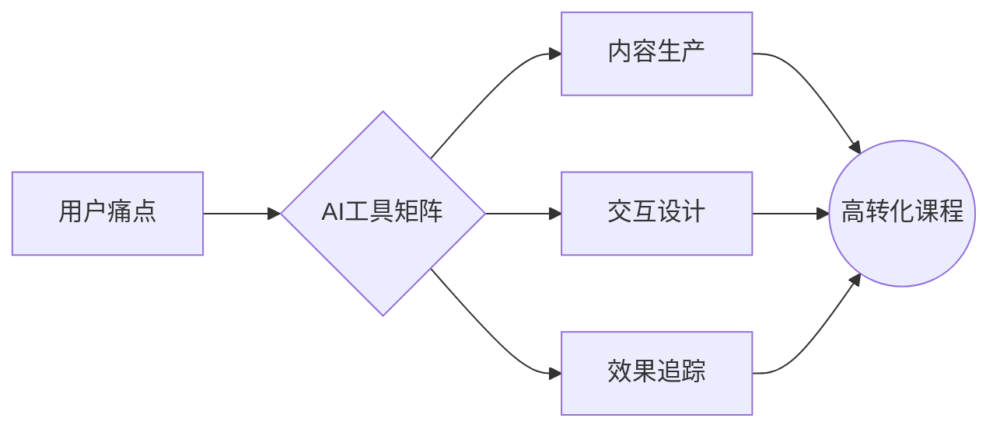

# 🤖 AI课程案例库（20+实战模板）

## 教育转型类（7个案例）

### 案例1：英语老师转型AI口语教练
**痛点**：传统口语课完课率<30%  
**解决方案**：  
- 用ChatGPT生成100个真实对话场景  
- ElevenLabs克隆声音打造24小时陪练  
- Midjourney制作虚拟学习环境  
**课程结构**：  
1. 晨间5分钟AI情景对话  
2. 午间AI发音纠正实验室  
3. 晚间VR沉浸式场景演练  
**成果**：学员日均开口时长从3min→47min  

### 案例2：数学教培机构AI化改造
**反常识点**：用游戏机制让数学题上瘾  
**AI工具组合**：  
- ChatGPT生成1000道趣味变式题  
- DALL·E3制作数学谜题视觉海报  
- 自研错题分析机器人  
**课程亮点**：  
✅ 每个知识点配3个现实应用案例  
✅ 错题自动生成针对性训练包  
✅ 积分可兑换AI家教辅导时长  

// 教育类其他5个案例（K12/职业教育/语言学习等）...

---

## 职场跃迁类（8个案例）

### 案例8：HR转型AI面试教练
**人性洞察**：利用求职者恐惧心理  
**课程架构**：  
1. ChatGPT模拟20类刁钻面试问题  
2. HeyGen打造虚拟面试官进行压力测试  
3. AI分析微表情/语音给出改进建议  
**变现路径**：  
- 企业定制版：9800元/账号/年  
- 个人版：9.9元/次模拟面试  

### 案例9：普通职员打造升职加速课
**AI工具组合**：  
- ChatGPT生成100个职场话术模板  
- Canva设计会议纪要自动生成器  
- Synthesia制作向上管理教学视频  
**课程结构**：  
⏰ 晨会话术包  
📊 数据汇报模版库  
🚀 跨部门协作危机处理手册  

// 职场类其他6个案例（PPT制作/时间管理/副业变现等）...

---

## 兴趣变现类（7个案例）

### 案例15：厨艺爱好者AI美食课
**创新点**：用AI破解"一看就会，一做就废"魔咒  
**技术组合**：  
1. ChatGPT生成食材替代方案数据库  
2. Midjourney制作3D菜品分解图  
3. Sora生成烹饪过程短视频  
**课程特色**：  
🔧 智能冰箱食材扫描→推荐菜谱  
⏳ 根据忙碌程度推荐烹饪方案  
🌍 地域口味自适应调整功能  

### 案例16：旅行博主转型AI导游训练师
**痛点解决**：让小白产出专业级旅行攻略  
**AI流水线**：  
- ChatGPT生成10种叙事风格的攻略模板  
- Pictory自动将文字转视频攻略  
- Murf.ai生成多语种配音版本  
**课程模块**：  
🗺️ 爆款攻略元素拆解器  
📸 手机出片参数自动生成器  
🎬 沉浸式旅行VLOG脚本库  

// 兴趣类其他5个案例（健身/手作/艺术创作等）...

---

## 课程设计逻辑库

## 实操模板包
1. **ChatGPT提示词库**：  
   - "请生成10个颠覆[行业]认知的课程选题"  
   - "用幼儿园话术解释[专业概念]"  
2. **AI课程开发SOP**：  
   痛点挖掘→竞品分析→内容生成→形式创新→交付测试  

> 🚨 注意事项：所有案例需进行本土化改造，替换案例中的行业关键词即可快速复用