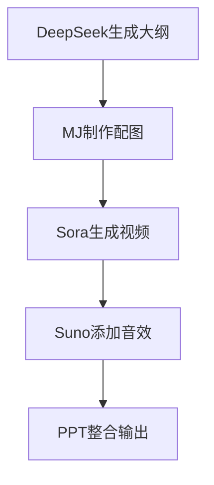
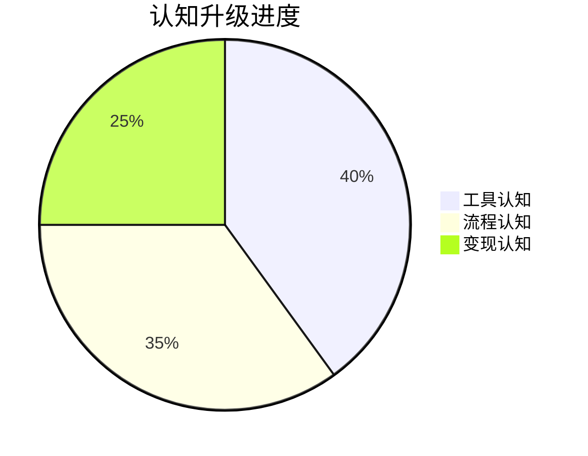

# Day1：认知重启 - AI造课新纪元

## 反常识认知点
`🚪 破界认知：AI课程=流水线生产`
- 传统误区：制作课程需要专业团队
- AI真相：1人+5工具=课程工厂
- 核心公式：$$课程价值 = (内容质量 × 呈现形式) ÷ 制作时间$$

## 傻瓜操作流程


### 三阶认知升级
1. **工具认知（10分钟）**
   ```mermaid
   flowchart LR
       工具定位 --> 应用场景 --> 组合逻辑
   ```
   - 示例：DeepSeek生成脚本 → MJ制作封面 → Sora生成讲解视频

2. **流程认知（15分钟）**
   - 知识萃取 → 视觉转化 → 影音合成
   - 示例：用Suno生成课程背景音乐模板

3. **变现认知（20分钟）**
   - 课程产品化 → 渠道矩阵 → 自动化交付
   - 示例：AI PPT生成试看章节自动发送系统

## 今日任务（5分钟）
`🎯 解锁【认知突破者】徽章`
1. 生成首个课程标题
2. 创建课程封面初稿
3. 制作10秒课程预告

## 成就体系


## 失败者案例
**李老师的困境**：
花3个月制作课程，上线后0销量。关键错误：没有验证市场需求。

> 🔑 破局关键：用AI生成5个版本课程大纲测试点击率

## 思维升级
```mermaid
graph TB
    知识焦虑 --> 解决方案 --> 产品封装
    用户痛点 --> 内容生产 --> 自动交付
