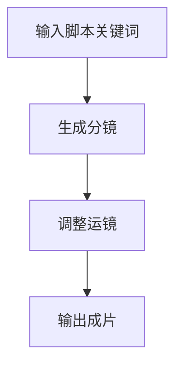
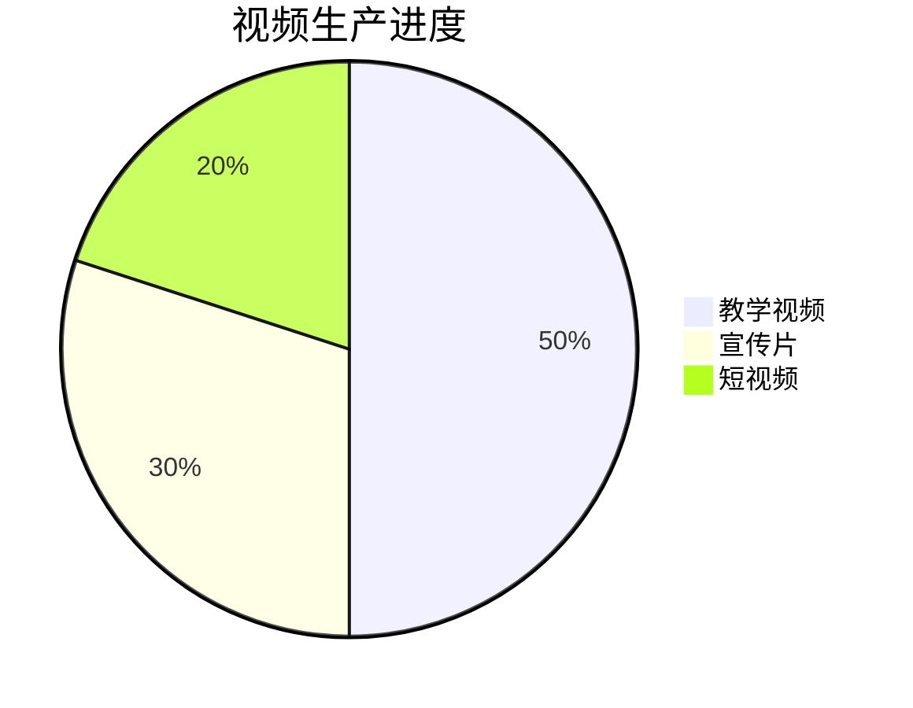

# Day3: 视频工厂革命 - Sora终极应用

## 反常识认知点
`🎥 视频制作新范式：零剪辑=电影级效果`
- 传统误区：需要专业剪辑团队
- AI真相：3提示词生成全流程视频
- 核心公式：$$视频吸引力 = (信息密度 × 情绪张力) ÷ 时长$$

## 傻瓜操作流程


### 三维视频系统
1. **教学视频生成（15分钟）**
   ```mermaid
   flowchart LR
       知识点拆解 --> 场景可视化 --> 动态演示生成
   ```
   - 示例提示词："生成3分钟AI工具教学视频，包含步骤演示和字幕"

2. **宣传片工厂（20分钟）**
   - 痛点场景重建
   - 前后对比演示
   - 客户证言模拟
   - 示例提示词："制作课程宣传片，展示学员从0到1的蜕变"

3. **短视频矩阵（25分钟）**
   - 爆款结构复制
   - 多平台适配
   - 自动水印添加
   - 示例提示词："生成10个抖音风格的知识付费短视频"

## 今日任务（5分钟）
`🎯 解锁【视频导演】徽章`
1. 生成30s教学视频
2. 制作课程宣传片
3. 创建5个短视频素材

## 成就体系


## 失败者案例
**张导演的教训**：
花费10万拍摄课程视频，完播率仅8%。关键错误：没有用AI测试视频效果。

> 🔑 破局关键：用Sora生成100个版本进行数据测试

## 高级技巧
```mermaid
graph TB
    热点追踪 --> 情绪锚点 --> 行为触发
    多模态融合 --> 个性化推荐 --> 自动传播
