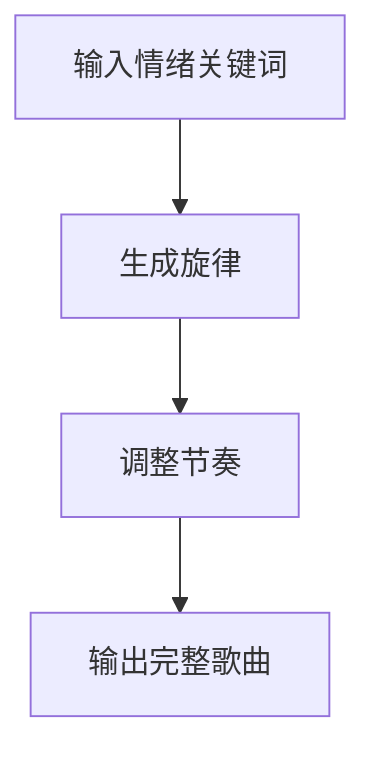
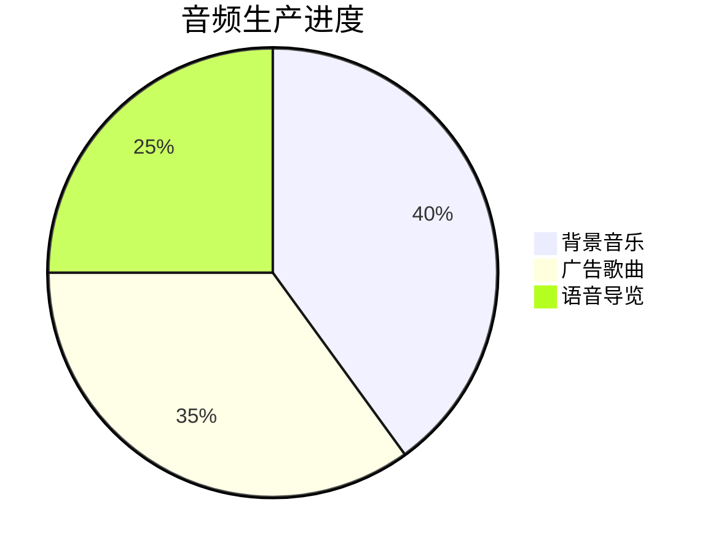
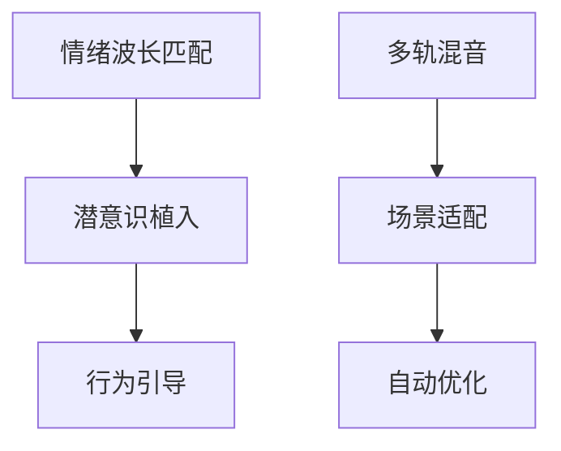

# Day4: 声音炼金术 - Suno终极应用

## 反常识认知点
`🎵 声音营销革命：BGM=情绪开关`
- 传统误区：音乐需要专业制作
- AI真相：3步生成洗脑神曲
- 核心公式：$$记忆度 = (节奏 × 歌词)² ÷ 时长$$

## 傻瓜操作流程


### 三维音频系统
1. **课程BGM生成（10分钟）**
   ```mermaid
   flowchart LR
       课程主题 --> 情绪匹配 --> 自动配乐
   ```
   - 示例提示词："生成3分钟知识付费课程背景音乐，节奏轻快带科技感"

2. **广告神曲工厂（15分钟）**
   - 品牌关键词提取
   - 洗脑副歌生成
   - 多语言适配
   - 示例提示词："创作课程推广神曲，包含中英文副歌循环"

3. **语音导播系统（20分钟）**
   - 自动旁白生成
   - 情感语调调节
   - 多角色对话
   - 示例提示词："生成男女双人对话的课程预告语音"

## 今日任务（5分钟）
`🎯 解锁【音乐制作人】徽章`
1. 生成课程专属BGM
2. 创作广告推广曲
3. 制作3分钟语音导览

## 成就体系


## 失败者案例
**李老师的教训**：
花5万定制课程音乐，学员留存率反降15%。关键错误：人工配乐与课程节奏不匹配。

> 🔑 破局关键：用Suno生成20个版本进行A/B测试

## 高级技巧

