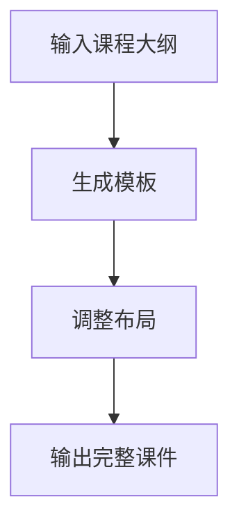
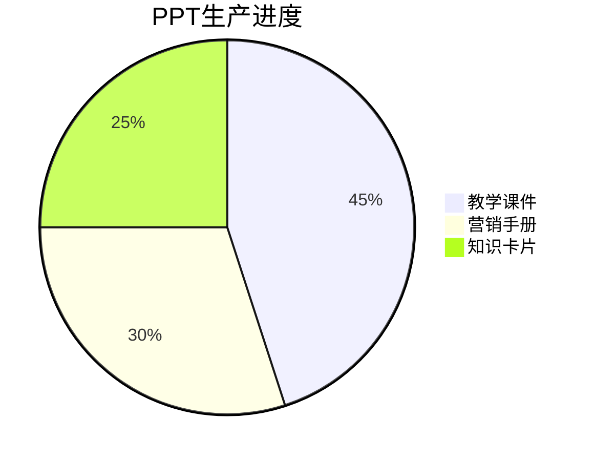

# Day5: PPT魔法学院 - AI PPT终极应用

## 反常识认知点
`📊 幻灯片革命：1分钟=专业级课件`
- 传统误区：PPT需要设计团队
- AI真相：3提示词生成整套课件
- 核心公式：$$课件价值 = (信息密度 × 视觉冲击) × 逻辑性$$

## 傻瓜操作流程


### 三维PPT系统
1. **教学课件生成（10分钟）**
   ```mermaid
   flowchart LR
       知识体系 --> 视觉化拆解 --> 自动排版
   ```
   - 示例提示词："生成30页AI工具教学课件，包含流程图和案例对比"

2. **营销手册工厂（15分钟）**
   - 卖点自动提取
   - 数据可视化
   - 多终端适配
   - 示例提示词："制作课程推广手册，包含10个转化页面"

3. **知识卡片系统（20分钟）**
   - 重点知识拆解
   - 卡片式排版
   - 自动生成记忆点
   - 示例提示词："生成50张知识卡片用于社群传播"

## 今日任务（5分钟）
`🎯 解锁【PPT大师】徽章`
1. 生成教学课件
2. 制作营销手册
3. 创建知识卡片集

## 成就体系


## 失败者案例
**王经理的教训**：
雇设计师做课件，转化率仅5%。关键错误：过度设计导致信息模糊。

> 🔑 破局关键：用AI生成10个版本测试点击率

## 高级技巧
```mermaid
graph TB
    视觉动线设计 --> 信息焦点强化 --> 行为引导
    多模态融合 --> 智能动画 --> 自动优化
