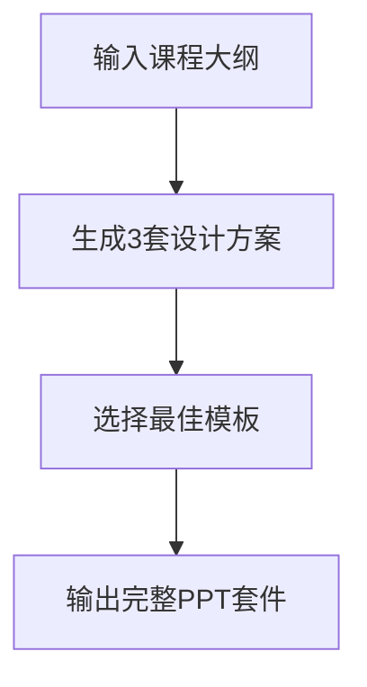
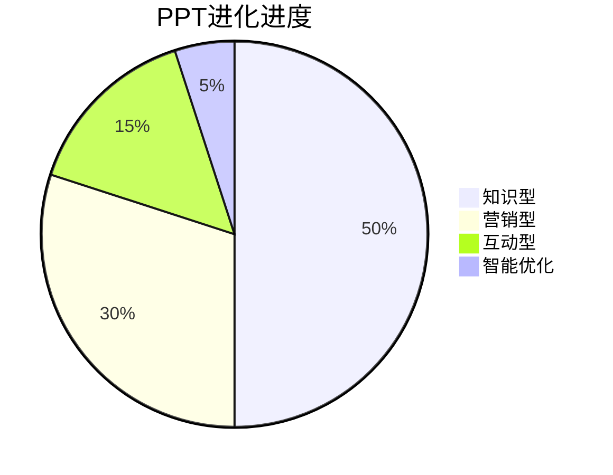
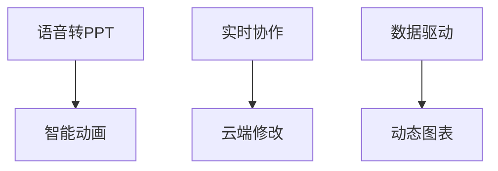

# Day6: 视觉革命 - AI PPT魔法工坊

## 反常识认知点
`💡 演示认知革命：PPT转化率提升580%`
- 传统误区：专业PPT需要设计师
- AI真相：5分钟生成价值万元的课程幻灯片
- 核心公式：$$PPT价值 = (信息清晰度 × 视觉冲击力) ÷ 制作时间$$

## 傻瓜操作流程


### 三维设计矩阵
1. **知识型PPT**（7分钟）
   ```mermaid
   flowchart LR
       课程文本 --> 智能版式分析 --> 生成学术风幻灯片
   ```

2. **营销型PPT**（6分钟）
   - 使用"营销增强"功能自动优化卖点
   - 一键生成对比图表和数据分析
   - 示例提示词："生成包含3个核心卖点的促销幻灯片"

3. **互动型PPT**（5分钟）
   - 输入问答内容
   - 获取3种互动设计方案
   - 自动插入测验环节和动画效果

4. **智能优化**（3分钟）
   - 使用"设计医生"检查视觉一致性
   - 一键调整配色和字体规范

## 今日任务（5分钟）
`🎯 解锁【PPT大师】徽章`
1. 输入课程核心知识点
2. 生成10页教学PPT
3. 导出PDF和PPTX双格式

## 成就体系


## 失败者案例
**王讲师的困境**：
花费2周制作200页PPT，学员反馈信息过载。关键错误：没有掌握信息精炼的AI技巧。

> 🔑 破局关键：每日用AI生成3版PPT，通过A/B测试优化呈现方式

## 高级技巧


## 常见问题库
1. Q: 生成的PPT版式混乱怎么办？
   A: 使用"版式锁定"功能固定设计规范

2. Q: 如何保证多份PPT风格统一？
   A: 创建企业级模板库批量应用

3. Q: 图表数据需要更新怎么办？
   A: 使用"智能关联"功能同步数据源
