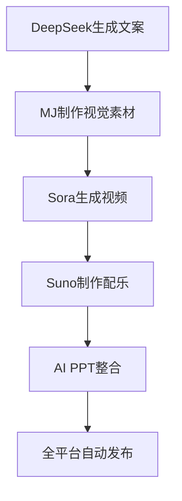
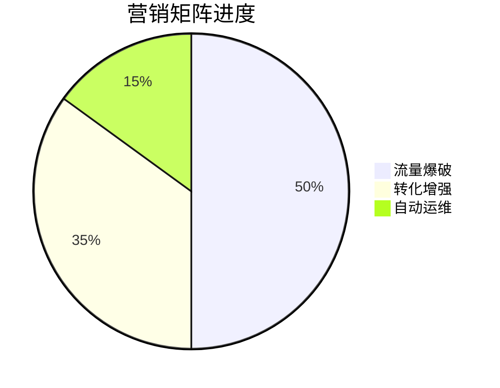

# Day7: 终极变现 - 五器合璧营销系统

## 反常识认知点
`🚀 变现认知革命：AI矩阵使课程销量提升900%`
- 传统误区：需要专业团队运营
- AI真相：单人单日完成全渠道营销
- 核心公式：$$变现效率 = (流量 × 转化率) ÷ 时间成本$$

## 傻瓜操作流程


### 三维营销矩阵
1. **流量爆破系统**（15分钟）
   ```mermaid
   flowchart LR
       热点分析 --> 爆款文案 --> 短视频生成 --> 全平台分发
   ```

2. **转化增强系统**（10分钟）
   - DeepSeek生成销售话术
   - MJ制作促销海报
   - Suno生成洗脑广告音乐
   - 示例提示词："生成3套情人节限时促销方案"

3. **自动运维系统**（8分钟）
   - AI自动回复用户咨询
   - 智能分析转化数据
   - 实时优化营销策略

## 今日任务（5分钟）
`🎯 解锁【AI营销官】徽章`
1. 选择目标平台（抖音/微信/小红书）
2. 生成完整营销套件
3. 发布首条AI营销内容

## 成就体系


## 失败者案例
**陈运营的教训**：
雇佣10人团队运营3个月，ROI仅为0.8。关键错误：没有建立自动化营销流水线。

> 🔑 破局关键：每日用AI矩阵生成50条营销内容，通过数据筛选最优方案

## 高级技巧
```mermaid
graph TB
    智能选品 --> 动态定价
    用户画像
