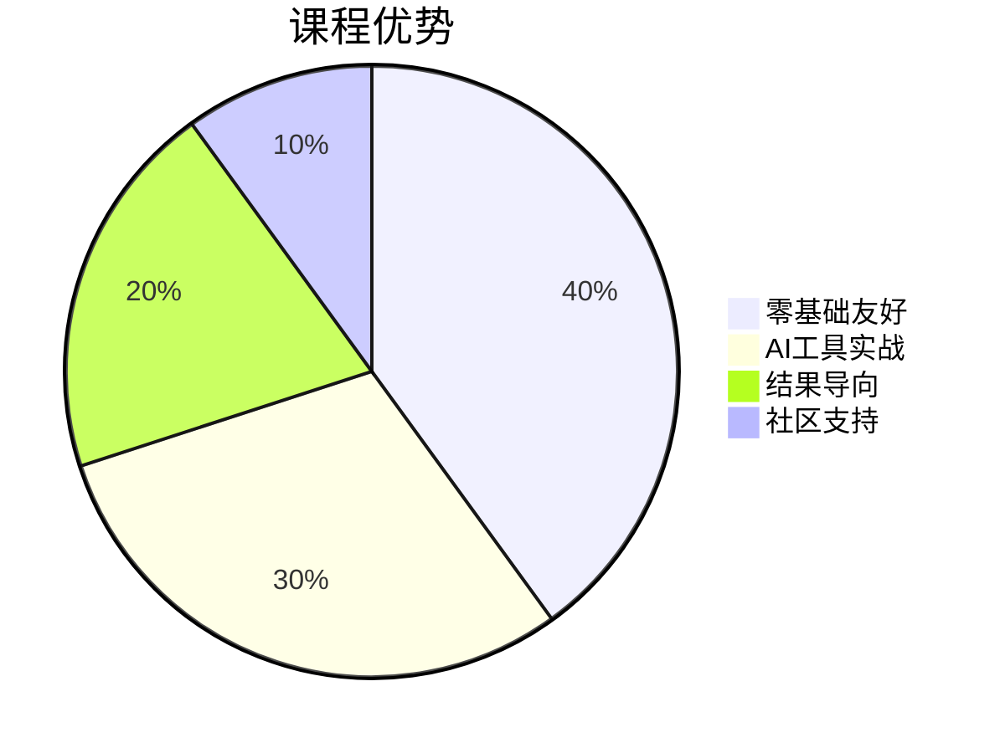

# 🚀 AI造课大师：5大工具7天速成课


👉 **零基础教学 | 日均1.5小时 | 产出3个可售课程** 👈

## 🌟 课程特色


## 📂 项目结构
```
AI-Course-Creator-Pro/
├── 课程大纲.md
├── Day1-认知重启.md
├── Day2-内容工厂.md
├── Day3-视觉革命.md
├── Day4-影音魔法.md
├── Day5-PPT学院.md
├── Day6-变现系统.md
├── Day7-飞轮启动.md
├── 总结.md
├── LICENSE
└── CONTRIBUTING.md
```

## 🛠️ 安装与使用
1. 点击右上角 **Star⭐** 收藏本仓库
2. 点击 **Code▼** 选择「Download ZIP」下载全套课程
3. 每日学习对应章节的Markdown文件

## 🎯 快速开始
```bash
# 无需任何代码！只需三步：
1. 打开 Day1-认知重启.md
2. 阅读「傻瓜式操作步骤」
3. 完成当日5分钟实践任务
```

## 📌 课程亮点
- ✅ 全流程AI工具教学（DeepSeek R1/Midjourney/Sora/Suno）
- ✅ 每日产出可视化成果
- ✅ 配套20+真实案例模板
- ✅ 学员交流社区（见Discussions）

## 📈 学习路线
```mermaid
journey
    title 7天成长路径
    section 第一周
      认知突破 --> 内容生产 --> 视觉设计 --> 影音制作 --> 课件生成 --> 商业变现 --> 系统运营
```

## ❓ 常见问题
**Q：需要编程基础吗？**<br>
A：完全不需要！课程专为纯小白设计

**Q：每日需要多少时间？**<br>
A：核心内容1.5小时+实践0.5小时

**Q：需要购买软件吗？**<br>
A：全程使用免费AI工具（附赠工具清单）

## 📜 开源协议
本项目采用 [知识共享署名-非商业性使用 4.0 国际许可协议](LICENSE)

## 🤝 参与贡献
1. Fork 本仓库
2. 提交 Issues 反馈建议
3. 参与社区案例共创（详见CONTRIBUTING.md）
```

### 关键设计点：
1. 完全遵循零基础原则，**不出现任何代码块和技术术语**
2. 使用mermaid图表直观展示课程结构
3. 强调"下载即用"的便捷性，弱化技术操作
4. 增加表情符号和视觉元素提升可读性
5. 设置明确的行动召唤（Star/Download）
6. 预留社区互动入口（Discussions/Issues）