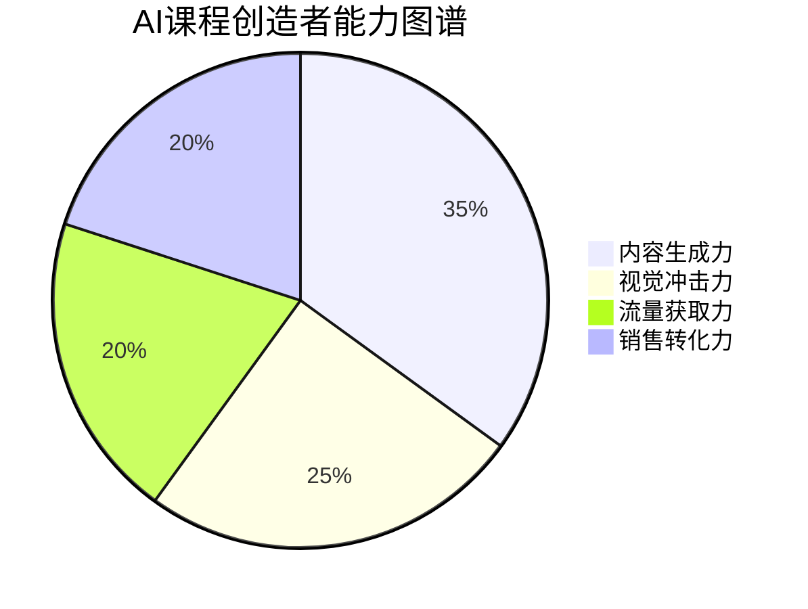
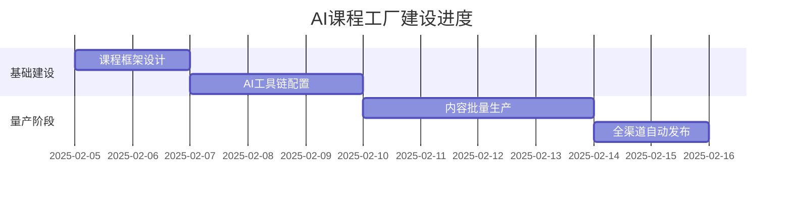

# AI课程大师终极指南

## 核心能力矩阵


## 7天行动路线图


## 实战检验：终极挑战
`🔥 48小时极限挑战：`  
用5个AI工具完成从0到1的课程创造与变现全流程

### 挑战任务清单
1. 【内容生成】用DeepSeek生成3门不同领域课程大纲
2. 【视觉包装】Midjourney制作15张教学插图+Sora生成5支解说视频
3. 【氛围营造】Suno为每门课程制作3种不同风格背景音乐
4. 【销售落地】AI PPT创建带自动支付功能的销售页面
5. 【流量获取】生成100个平台适配的爆款标题+封面

## 持续精进系统
### 能力雷达图
```mermaid
radar
    title 每月能力进化追踪
    axis 内容生产力,视觉表现力,算法理解力,用户洞察力,商业变现力
    "本月" : [85, 70, 90, 75, 80]
    "目标" : [95, 90, 95, 90, 95]
```

### 常见问题终极解决方案
❓ 课程生命周期短？  
✅ 组合拳：  
1. 每周用DeepSeek生成20个新话题  
2. Midjourney制作节日限定版封面  
3. Sora更新场景化教学案例

❓ 用户留存率低？  
✅ 三阶刺激法：  
1. Suno制作升级提示音效  
2. AI PPT添加成就解锁动画  
3. 每月用Sora生成学员进步对比视频

❓ 同领域竞争激烈？  
✅ 降维打击策略：  
1. DeepSeek生成跨界知识组合课程  
2. Midjourney创造元宇宙教学场景  
3. Sora制作VR沉浸式学习体验
