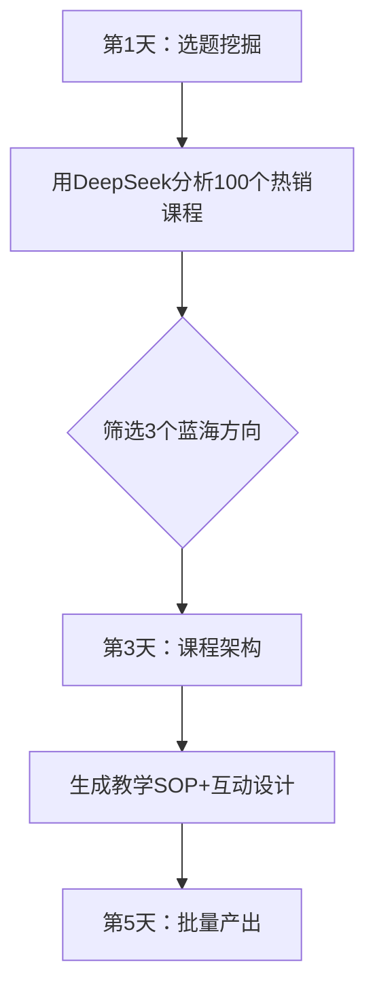

# 🌟【星球专属】用DeepSeek批量生产高转化课程的5个核武器

## 🚨 紧急通知：刚更新的AI造课资源包已放入星球工具箱（含独家模板）

### 🔥 今日重磅资源：
1️⃣ **《DeepSeek课程生产线》**  
- 内置7大课程模版（知识付费/训练营/碎片课）  
- 每个模版含：  
   ✅ Deepseek提示词链（20步精准生成）  
   ✅ Midjourney封面设计参数  
   ✅ 转化率提升30%的标题库  

2️⃣ **《爆款课元素拆解器》**  
- 输入任意知识点→自动生成10种课程形式  
- 案例：  
   "时间管理"→AI生成：  
   📌 5分钟沙漏学习法  
   📌 职场妈妈时间折叠术  
   📌 游戏化TODO清单设计  

### 🛠️ 本周实操任务：


### 💎 星球会员特权：
1. **《课程冷启动包》**：  
   - 500+精准流量话术  
   - 30个免版权视频素材站  
   - 自动生成课纲的Notion模板  

2. **每周直播加餐**：  
   🕒 每周三20:00 DeepSeek高阶用法教学  
   🕒 每周五案例拆解：最新爆款课AI逆向工程  

### 🌰 学员案例：  
@运营小张 用星球模板1周做出3门课，单日最高收益破万：  
- Deepseek生成6.5万字初稿  
- 用AI设计9.9/199/2999价格阶梯  
- 自动生成100个短视频切片  

---

**🚀 今日行动指南**  
1. 在课程中心 领取最新AI工具包  
2. 用#课程诊断 功能分析你的课程雏形  
3. 参与#7天造课挑战

> 👉 转发本贴邀请3位好友加入，私信我领取《课程分销话术库》📩
```
