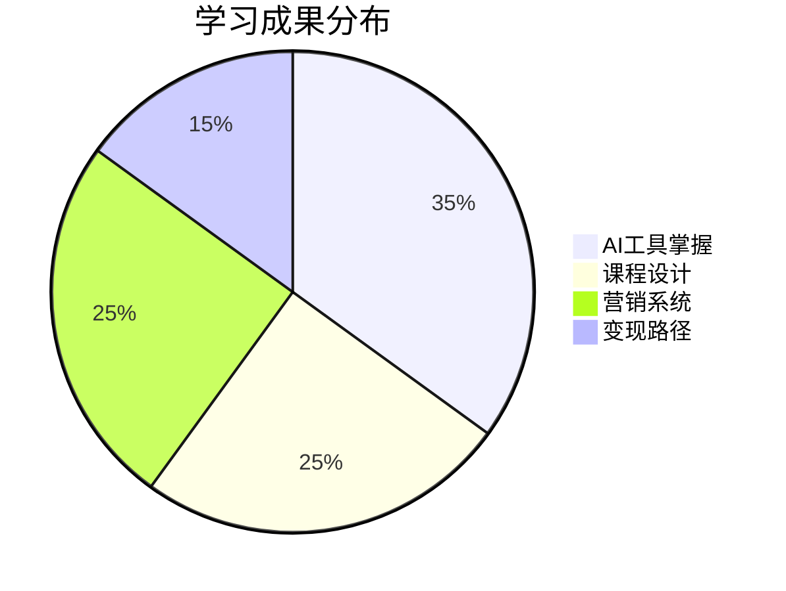

# 《AI造课大师：5大工具7天速成课》课程大纲

## 课程目标
`🚀 零基础7天掌握AI全流程课程制作`
- 日均学习1.5小时
- 产出3个可售课程原型
- 搭建完整知识付费体系

## 课程收益


## 课程模块
### Day1：认知重启
- 破除AI课制作三大误区
- 建立最小可行性课程模型

### Day2：内容工厂
- DeepSeek R1爆款课框架生成
- 知识体系结构化秘籍

### Day3：视觉革命
- Midjourney教学配图全流程
- 风格化视觉系统搭建

### Day4：影音魔法
- Sora教学视频智能生成
- Suno背景音乐定制指南

### Day5：PPT学院
- AI PPT三合一应用系统
- 课件自动化生产流水线

### Day6：变现系统
- 课程定价策略
- 多渠道分发矩阵

### Day7：飞轮启动
- 课程迭代机制
- 自动化运营系统

## 互动设计
```mermaid
journey
    title 学习旅程
    section 每日任务
      认知突破 --> 工具实操 --> 成果输出
    section 反馈机制
      即时评分 --> 徽章奖励 --> 进度可视化
    section 成就体系
      新手 --> 能手 --> 大师
